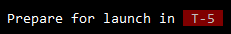

# T-Minus Logger [![travis][travis-image]][travis-url] [![npm][npm-image]][npm-url] [![downloads][downloads-image]][downloads-url] [![javascript style guide][standard-image]][standard-url]

[travis-image]: https://img.shields.io/travis/deependrx/t-minus-logger/master.svg
[travis-url]: https://travis-ci.org/deependrax/t-minus-logger
[npm-image]: https://img.shields.io/npm/v/t-minus-logger.svg
[npm-url]: https://npmjs.org/package/t-minus-logger
[downloads-image]: https://img.shields.io/npm/dm/t-minus-logger.svg
[downloads-url]: https://npmjs.org/package/t-minus-logger
[standard-image]: https://img.shields.io/badge/code_style-standard-brightgreen.svg
[standard-url]: https://standardjs.com

> A T-Minus countdown logger for indicating the time remaining before a process is scheduled to start.


## Why?

- Give time to review run params
- Give warning & action time before starting irreversible tasks

  


## Installation
```shell
$ npm i t-minus-logger
```


## Usage
```js
const countdown = require('t-minus-logger')

countdown('Prepare for launch', 5).then(() => {
    console.log('Launch ->');
});
```

**Note:**<br>
Please refer examples in repository for more usage options and default behaviour.


## License

MIT © [Deependra Mishra](https://www.linkedin.com/in/deependrax/)